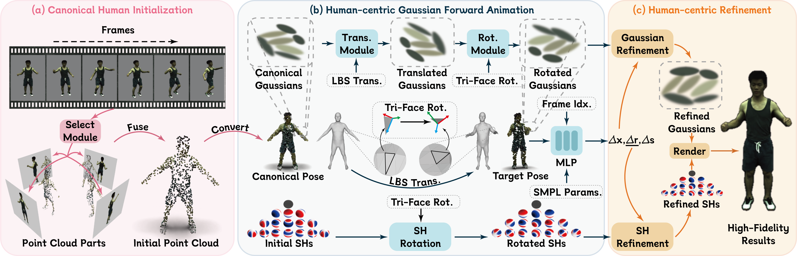

<div align="center">

# <b>Human101</b>: Training 100+FPS Human Gaussians in 100s from 1 View

[Mingwei Li](https://github.com/longxiang-ai), [Jiachen Tao](https://github.com/tlxhlll), [Zongxin Yang](https://z-x-yang.github.io), [Yi Yang](https://scholar.google.com/citations?user=RMSuNFwAAAAJ)<sup>\*</sup>

<sup>\*</sup>Corresponding author

ReLER, CCAI, Zhejiang University

[[Project Page](https://longxiang-ai.github.io/Human101/)] [[ArXiv](https://arxiv.org/abs/2312.15258)] [[Supplementary Material](https://arxiv.org/abs/2312.15258)]

</div>

## Introduction

We propose **Human101**, a fast 1-view human reconstruction framework. Human101 is able to train 3D Gaussians in 100 seconds and render 1024-resolution images at 60+ FPS, **without necessitating the pre-storage of per-frame Gaussian attributes**. The pipeline of Human101 is shown as follows:


## Abstract

Reconstructing the human body from single-view videos plays a pivotal role in the virtual reality domain. One prevalent application scenario necessitates the rapid reconstruction of high-fidelity 3D digital humans while simultaneously ensuring real-time rendering and interaction. Existing methods often struggle to fulfill both requirements. In this paper, we introduce Human101, a novel framework adept at producing high-fidelity dynamic 3D human reconstructions from 1-view videos by training 3D Gaussians in 100 seconds and rendering in 100+ FPS. Our method leverages the strengths of 3D Gaussian Splatting, which provides an explicit and efficient representation of 3D humans. Standing apart from prior NeRF-based systems, Human101 ingeniously applies a Human-centric Forward Gaussian Animation to deform the parameters of 3D Gaussians, thereby enhancing rendering speed (i.e., rendering 1024-resolution images at an impressive 60+ FPS and rendering 512-resolution images at 100+ FPS). Experimental results indicate that our approach substantially eclipses current methods, clocking up to a 10 $ \times $ surge in frames per second and delivering comparable or superior rendering quality.

## News

- [2023/12/27] We release paper on [arXiv](https://arxiv.org/abs/2312.15258) and the [project page](https://longxiang-ai.github.io/Human101/).

## TODO list

- [√] Release demos & project page
- [ ] Release code

## Acknowledgement

Our implementation is mainly based on [3D Gaussian Splatting](https://github.com/graphdeco-inria/gaussian-splatting) , [Instant-nvr](https://github.com/zju3dv/instant-nvr), [InstantAvatar](https://github.com/tijiang13/InstantAvatar)
and the following open-source projects:

- [ECON](https://github.com/YuliangXiu/ECON)
- [GTA](https://github.com/River-Zhang/GTA)
- [EasyMoCap](https://github.com/zju3dv/EasyMocap/)
- [DreamGaussian](https://github.com/dreamgaussian/dreamgaussian)

And many thanks to the authors of [GTA](https://github.com/River-Zhang/GTA) and [TransHuman](https://github.com/pansanity666/TransHuman) for discussing some details about the implementation.

More related papers about 3D avatars: [Awesome-3D-Avatars](https://github.com/pansanity666/Awesome-Avatars).

## Citation

If you find this code useful for your research, please consider citing:

```bibtex
@misc{li2023human101,
      title={Human101: Training 100+FPS Human Gaussians in 100s from 1 View},
      author={Mingwei Li and Jiachen Tao and Zongxin Yang and Yi Yang},
      year={2023},
      eprint={2312.15258},
      archivePrefix={arXiv},
      primaryClass={cs.CV}
}
```
